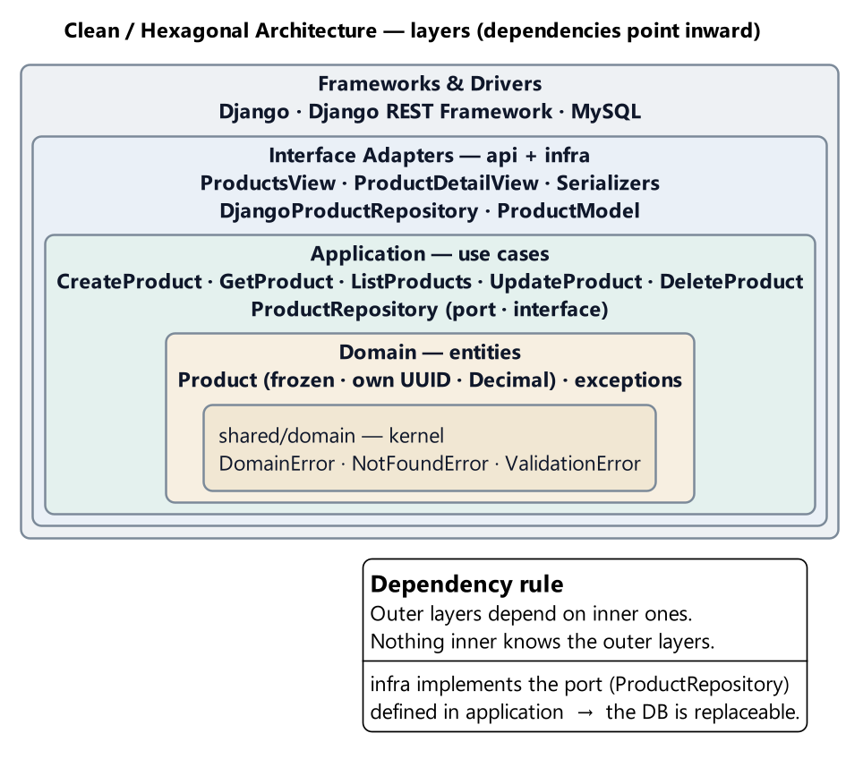
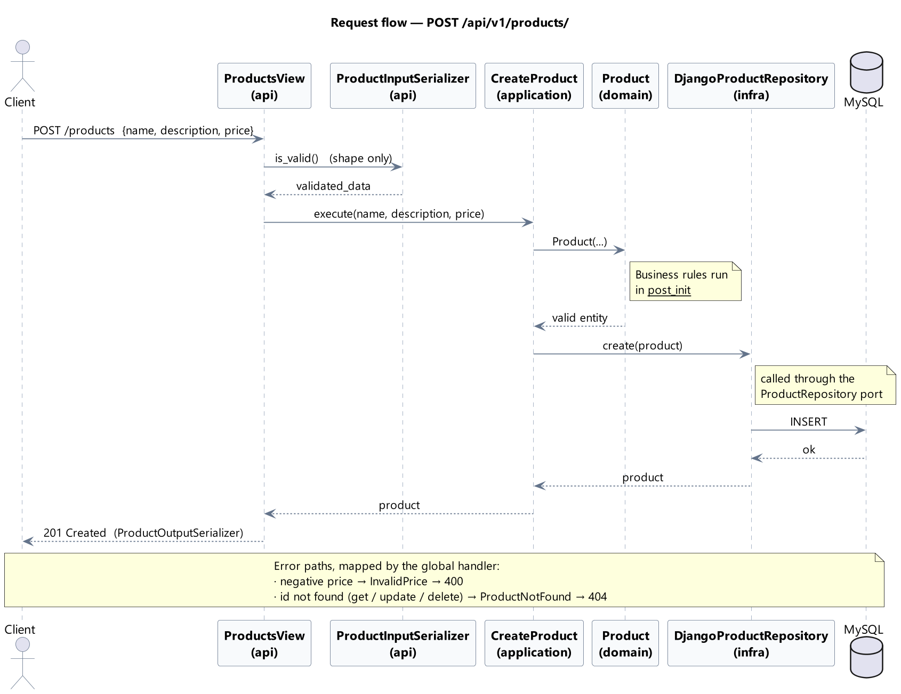

# Archi — Products API

CRUD de productos sobre Django, expuesto por **REST y GraphQL** contra MySQL.

El proyecto está construido con **arquitectura limpia**: `Product` es una dataclass de Python que no depende de Django, los casos de uso desconocen el framework y la base de datos entra por una interfaz que declara la capa de aplicación.

Los dos protocolos son adaptadores del mismo núcleo. Un producto creado por REST se consulta por GraphQL, y las reglas de negocio están escritas una sola vez.

---

## 🎥 Video explicativo

Recorrido por la arquitectura: las capas, el criterio detrás de cada decisión y una demostración de los endpoints en funcionamiento. Se recomienda empezar por acá.

[](https://youtu.be/lsR9zHbkV-A)

### ▶️ [Ver en YouTube](https://youtu.be/lsR9zHbkV-A)

| | |
|---|---|
| **Duración** | ~10 min |
| **Contenido** | Estructura por capas · Regla de dependencia · Casos de uso · Demo del CRUD · Manejo de errores |

También queda una copia en el repositorio, en [`docs/video/clean-architecture.mp4`](docs/video/clean-architecture.mp4), versionada con Git LFS.

La versión en texto de lo mismo son los [14 ADRs](docs/adrs/README.md) y la [wiki](docs/wiki/Home.md).

---

## Stack

| Pieza | Versión | Para qué |
|---|---|---|
| Python | 3.14 | Runtime |
| Django | 6.0.4 | Framework base, ORM y migraciones |
| Django REST Framework | 3.17.1 | Capa HTTP: serializers, vistas, manejo de errores |
| MySQL | 8.x | Base de datos |
| mysqlclient | 2.2.8 | Driver |
| python-decouple | 3.8 | Configuración por entorno |
| drf-spectacular | 0.30.0 | Esquema OpenAPI + Swagger UI |
| strawberry-graphql | 0.327.4 | Schema GraphQL + GraphiQL |

---

## Arquitectura: Clean Architecture

El proyecto implementa **Clean Architecture** (arquitectura limpia), el modelo por capas concéntricas de Robert C. Martin, usando **puertos y adaptadores** para conectar el núcleo con el exterior.

Lo que define a Clean Architecture, y la razón por la que el código está organizado así, es la **regla de dependencia** (*Dependency Rule*): las dependencias del código fuente apuntan siempre hacia el interior, nunca hacia afuera. Una capa puede conocer a las que tiene adentro; jamás a las que la contienen.

```
shared/domain  ←  domain  ←  application  ←  infra / api
```

### Las capas



Cada anillo depende únicamente de los que tiene por dentro. En el centro, `shared/domain` y la entidad `Product`, que no conocen ni HTTP ni SQL. En el borde, Django, DRF y MySQL, que son detalles reemplazables.

Cuando el flujo de control necesita ir en sentido contrario —la capa de aplicación tiene que llegar a la base de datos— se recurre al **principio de inversión de dependencias** (*DIP*): la capa interna declara la interfaz y la externa la implementa. Por eso `ProductRepository` es una ABC que vive en `application/`, mientras que `DjangoProductRepository` está en `infra/`.

Traducido a carpetas:

```
shared/domain/    Kernel compartido: excepciones base. Python puro.
products/
├── domain/       Entidad Product + excepciones de validación. Sin imports de Django.
├── application/  Puerto del repositorio (ABC) + los 5 casos de uso.
├── infra/        Modelo del ORM + repositorio concreto. Único lugar que toca el ORM.
└── api/          Los dos adaptadores web:
    ├── composition.py   Arma los casos de uso. Sin framework.
    ├── dependencies.py  El único módulo que nombra el repositorio concreto.
    ├── views.py         Adaptador REST (+ serializers, urls, metadata OpenAPI).
    └── graphql/         Adaptador GraphQL (tipos, queries, mutations, errores).
config/           settings, urls y el handler global de errores.
tests_unit/       Tests de domain, application y del schema GraphQL. Sin Django, sin DB.
```

Cuatro consecuencias de esa regla, útiles antes de leer el código:

- **`Product` no es un modelo de Django.** Es una dataclass congelada que se valida en el constructor. El modelo del ORM (`ProductModel`) es una clase distinta y vive en `infra/`.
- **Las reglas de negocio están en la entidad, no en los serializers.** El serializer valida forma (tipos, presencia); un precio negativo lo rechaza el dominio.
- **El repositorio no lanza "no encontrado".** Devuelve `None`, y es el caso de uso el que decide que eso corresponde a un `ProductNotFound`.
- **Ni las vistas ni los resolvers conocen el repositorio.** Reciben casos de uso ya construidos. Quién les inyecta la persistencia es asunto del composition root, y que exista un repositorio es un detalle que la capa web no tiene por qué saber.

### Recorrido de una request



El ejemplo es un `POST /api/v1/products/`. La vista valida la forma del payload y delega en `CreateProduct`; el caso de uso construye la entidad —ahí corren las reglas de negocio, en `__post_init__`— y la persiste a través del puerto, sin saber que del otro lado hay un ORM. Los caminos de error no pasan por la vista: la excepción sube hasta el handler global, que la traduce a `400` o `404`.

Ambos diagramas se generan con PlantUML a partir de las fuentes que están junto a las imágenes:

```bash
plantuml docs/diagrams/architecture.puml docs/diagrams/flow.puml
```

El fundamento de cada decisión está en [`docs/adrs/`](docs/adrs/README.md): 14 ADRs con las alternativas descartadas y el costo que se aceptó en cada caso.

---

## Puesta en marcha

### Requisitos previos

- Python 3.14
- Un servidor MySQL 8 en ejecución, con la base creada
- En Linux, para compilar `mysqlclient`: `sudo apt install default-libmysqlclient-dev build-essential pkg-config`

### Pasos

```bash
git clone <url-del-repo>
cd Archi

python -m venv .venv
# Windows
.venv\Scripts\activate
# Linux / macOS
source .venv/bin/activate

pip install -r requirements.txt
```

Copiar `.env.example` a `.env` y completar los valores:

```properties
SECRET_KEY=una-clave-larga-y-aleatoria
DEBUG=True
DOCS_ENABLED=True

DB_ENGINE=django.db.backends.mysql
DB_NAME=archi
DB_USER=root
DB_PASSWORD=tu-password
DB_HOST=localhost
DB_PORT=3306
```

`SECRET_KEY` no tiene valor por defecto a propósito: si falta, la aplicación no arranca.

Crear el esquema e iniciar el servidor:

```bash
python manage.py migrate
python manage.py runserver
```

La API queda disponible en `http://localhost:8000/api/v1/`.

---

## Endpoints

Base: `/api/v1/`

| Método | Ruta | Descripción | Respuesta |
|---|---|---|---|
| `GET` | `/products/` | Lista todos los productos | `200` |
| `POST` | `/products/` | Crea un producto | `201` |
| `GET` | `/products/{uuid}/` | Obtiene un producto por id | `200` / `404` |
| `PUT` | `/products/{uuid}/` | Reemplaza un producto | `200` / `400` / `404` |
| `DELETE` | `/products/{uuid}/` | Elimina un producto | `204` / `404` |

El `id` lo genera el dominio, no el cliente ni la base de datos: no forma parte del body del `POST`.

### Ejemplos

```bash
# Crear
curl -X POST http://localhost:8000/api/v1/products/ \
  -H "Content-Type: application/json" \
  -d '{"name": "Teclado mecánico", "description": "Switches marrones", "price": "89.90"}'
```

```json
{
  "id": "3f1c9d2e-8b7a-4c5d-9e6f-0a1b2c3d4e5f",
  "name": "Teclado mecánico",
  "description": "Switches marrones",
  "price": "89.90"
}
```

```bash
# Listar
curl http://localhost:8000/api/v1/products/

# Actualizar (reemplazo completo)
curl -X PUT http://localhost:8000/api/v1/products/3f1c9d2e-.../ \
  -H "Content-Type: application/json" \
  -d '{"name": "Teclado mecánico TKL", "description": "Sin numpad", "price": "99.00"}'

# Eliminar
curl -X DELETE http://localhost:8000/api/v1/products/3f1c9d2e-.../
```

El precio viaja como **string** en el JSON. Es el comportamiento de DRF con `DecimalField` y evita que el cliente lo reciba como float y pierda precisión.

---

## GraphQL

Segundo adaptador sobre los mismos casos de uso, servido con **Strawberry**. Un único endpoint:

| Ruta | Método | Contenido |
|---|---|---|
| `/graphql/` | `POST` | Queries y mutations |
| `/graphql/` | `GET` | GraphiQL, el explorador interactivo (solo con `DOCS_ENABLED=True`) |

### El schema

```graphql
type Query {
  products: [Product!]!
  product(id: UUID!): Product!
}

type Mutation {
  createProduct(input: ProductInput!): Product!
  updateProduct(id: UUID!, input: ProductInput!): Product!
  deleteProduct(id: UUID!): UUID!
}
```

### Consulta declarativa

El punto de GraphQL: **el cliente decide qué campos quiere**, y la respuesta trae eso y nada más.

```bash
curl -X POST http://localhost:8000/graphql/ \
  -H "Content-Type: application/json" \
  -d '{"query":"{ products { name } }"}'
```

```json
{ "data": { "products": [{ "name": "Monitor 27" }, { "name": "Teclado" }] } }
```

Pidiendo también el precio, sin cambiar nada del servidor:

```bash
curl -X POST http://localhost:8000/graphql/ \
  -H "Content-Type: application/json" \
  -d '{"query":"{ products { name price } }"}'
```

Y varias consultas en un solo request, con alias para distinguirlas:

```graphql
{
  catalogo: products { name price }
  destacado: product(id: "3f1c9d2e-8b7a-4c5d-9e6f-0a1b2c3d4e5f") { name description }
}
```

### Crear un producto

```bash
curl -X POST http://localhost:8000/graphql/ \
  -H "Content-Type: application/json" \
  -d '{"query":"mutation { createProduct(input: {name: \"Monitor 27\", price: \"320.00\", description: \"IPS 144Hz\"}) { id name price } }"}'
```

El `id` no va en el input: lo genera el dominio.

### Errores

GraphQL responde siempre `200`, así que la categoría del error viaja en `extensions.code`:

| Excepción del dominio | `extensions.code` |
|---|---|
| `NotFoundError` y derivadas | `NOT_FOUND` |
| `ValidationError` y derivadas | `BAD_REQUEST` |

```json
{
  "data": null,
  "errors": [{
    "message": "Price cannot be negative.",
    "path": ["createProduct"],
    "extensions": { "code": "BAD_REQUEST", "type": "InvalidPrice" }
  }]
}
```

Ese mensaje viene de la **entidad**, no del resolver. Es la misma regla que aplica REST: se escribió una vez y la usan los dos adaptadores.

---

## Documentación de la API

Con `DOCS_ENABLED=True`:

| Ruta | Contenido |
|---|---|
| `/api/docs/` | Swagger UI, con "try it out" |
| `/api/redoc/` | Redoc, orientado a lectura |
| `/api/schema/` | El OpenAPI 3.0 en YAML |
| `/graphql/` | GraphiQL, para explorar el schema GraphQL |

El repositorio incluye además una copia versionada del esquema en [`docs/openapi/schema.yaml`](docs/openapi/schema.yaml), que permite consultarlo o generar clientes sin levantar la aplicación. Se regenera con:

```bash
python manage.py spectacular --file docs/openapi/schema.yaml
```

**En producción corresponde `DOCS_ENABLED=False`.** Con la bandera apagada las rutas de Swagger no se registran, drf-spectacular ni siquiera se importa y GraphiQL deja de servirse, con lo que tampoco queda expuesta la introspección del schema. El endpoint `/graphql/` sigue funcionando para queries; lo que desaparece es el explorador.

Las anotaciones OpenAPI viven en `products/api/schema.py` y se evalúan una sola vez al importar el módulo: no agregan trabajo por request. El detalle está en el [ADR 0013](docs/adrs/0013-openapi-con-drf-spectacular.md).

---

## Manejo de errores

Toda respuesta de error usa el mismo sobre, emitido por un handler global (`config/exception_handler.py`):

```json
{
  "error": {
    "status": 400,
    "type": "InvalidPrice",
    "detail": "Price cannot be negative."
  }
}
```

`type` es el nombre de la excepción, lo que permite distinguir un `InvalidPrice` de un `InvalidName` sin parsear el mensaje.

El handler mapea por categoría, no por excepción concreta:

| Excepción | HTTP |
|---|---|
| `NotFoundError` y sus derivadas (`ProductNotFound`) | `404` |
| `ValidationError` y sus derivadas (`InvalidName`, `InvalidDescription`, `InvalidPrice`) | `400` |
| Errores de forma de DRF | Su propio código, con el mismo sobre |
| Cualquier otra excepción | `500`, sin enmascarar el bug |

---

## Tests

```bash
python -m unittest discover -s tests_unit -t . -v
```

45 tests sobre `domain`, `application` y el schema GraphQL, sin Django y sin base de datos. Todo se ejecuta contra un repositorio en memoria que implementa la misma interfaz que el real.

Que el schema GraphQL se pueda testear así no es casualidad: los resolvers reciben los casos de uso por el contexto, de modo que el test construye el mismo paquete que arma la vista, pero sobre memoria.

Incluye un guardarraíl (`tests_unit/test_isolation.py`) que importa los módulos internos **en un subproceso limpio** y falla si alguno arrastró Django, DRF o Strawberry. El subproceso es necesario: medir `sys.modules` en el proceso de tests daría un falso positivo, porque los tests de GraphQL importan Strawberry legítimamente. Es lo que vuelve verificable la regla de dependencia, en lugar de dejarla como una convención documentada que nadie controla.

Pendiente: tests de integración sobre `infra` y las vistas REST (con `APITestCase` de DRF o Playwright en modo API). Esas capas todavía no tienen cobertura automática.

---

## Estructura del repositorio

```
Archi/
├── config/               settings, urls, handler global de errores
├── products/
│   ├── domain/           entidad + excepciones de negocio
│   ├── application/      puerto del repositorio + casos de uso
│   ├── infra/            modelo del ORM + repositorio Django
│   ├── api/
│   │   ├── composition.py    arma los casos de uso (sin framework)
│   │   ├── dependencies.py   elige el repositorio concreto
│   │   ├── graphql/          adaptador GraphQL
│   │   └── ...               adaptador REST: serializers, vistas, rutas, OpenAPI
│   └── migrations/       esquema versionado
├── shared/domain/        excepciones base compartidas
├── tests_unit/           tests sin Django ni DB
├── docs/
│   ├── adrs/             14 decisiones de arquitectura
│   ├── diagrams/         .puml + .png
│   └── openapi/          schema.yaml generado
├── .env.example
├── requirements.txt
└── manage.py
```
